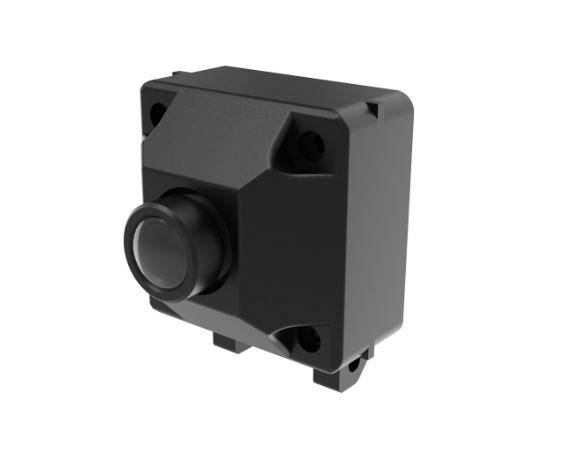

# Synria USB Camera SDK

[官方淘宝店](https://g84gtpygdv6trpvdhcsy0kfr73avcip.taobao.com/shop/view_shop.htm?appUid=RAzN8HWKU5B7MfX6JjEWgkuNfftNVbnrjbjx6fPjY9KqXB46Rvy&spm=a21n57.1.hoverItem.2) | [产品手册（中文）](https://docs.sparklingrobo.com/)

<p align="center"></p>

## C10 相机简介
Synria C10 是深圳市玄雅科技有限公司自研的机械臂腕部摄像头，具备 800 万像素、4K 超高清广角成像能力，采用免驱 USB 接口设计，实现开箱即插即用，可在 Windows / macOS / Linux 上直接进行视频采集。

## 环境要求
- Python 3.10+

## 安装
```bash
python -m pip install -e .
```
推荐在虚拟环境中安装：
```bash
# Windows (PowerShell)
python -m venv .venv
./.venv/Scripts/Activate.ps1
python -m pip install -e .

# macOS / Linux (bash)
python -m venv .venv
source .venv/bin/activate
python -m pip install -e .
```
说明：当前包名为 `synria_c10`，尚未发布到 PyPI；发布后可直接 `python -m pip install synria_c10`。如果平台上的 OpenCV 轮子缺少视频 IO 后端，请先安装系统依赖或自行构建带视频支持的 OpenCV。
```

## 快速开始（直接运行示例）
1. 安装依赖（建议在本目录 venv 中）：
    ```bash
    python -m pip install -e .
    ```
2. 运行示例（Windows）：
    ```powershell
    .\.venv\Scripts\python.exe examples\camera_use.py
    ```
    macOS / Linux：
    ```bash
    python examples/camera_use.py
    ```

示例默认假定外接 C10 在 device_index=1，并在 Windows 使用 `backend=cv2.CAP_DSHOW`；按 `q` 或点窗口右上角关闭可退出，如果本机不带默认摄像头，需要设置device_index=0，在ubuntu中使用时可能根据需要调整device_index=2，backend=cv2.CAP_V4L2。

## 目录结构
- `src/synria_cam/`：SDK 实现
- `examples/`：可直接运行的示例
